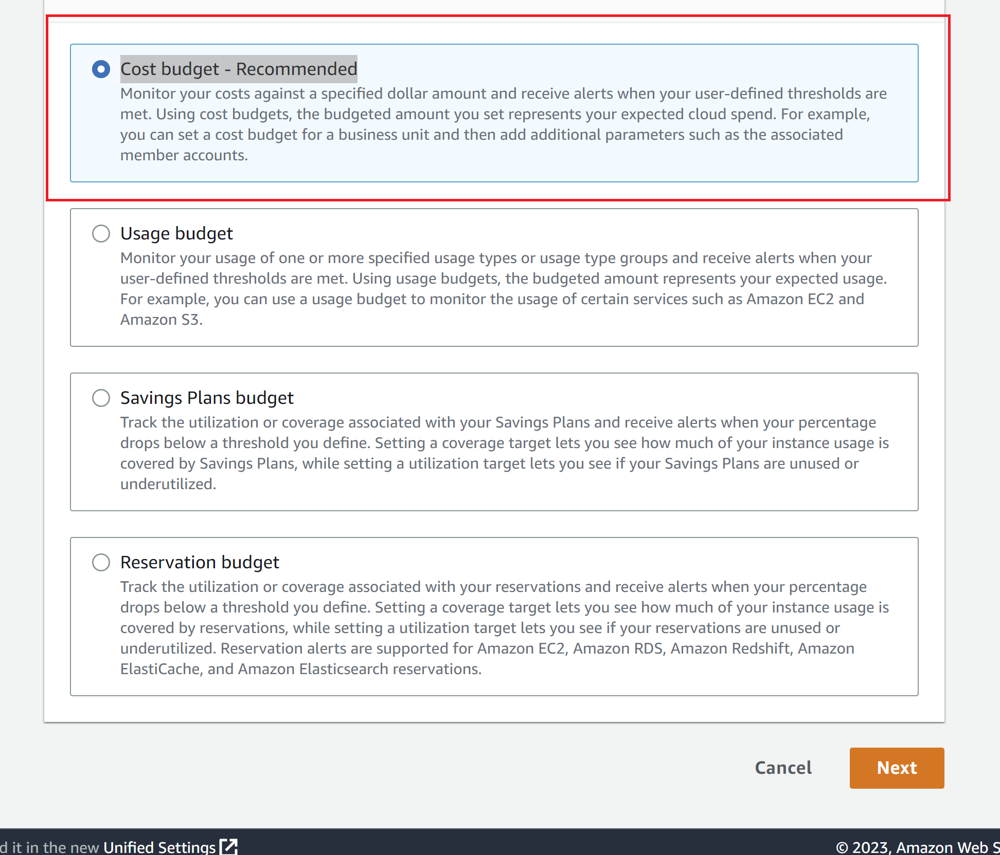
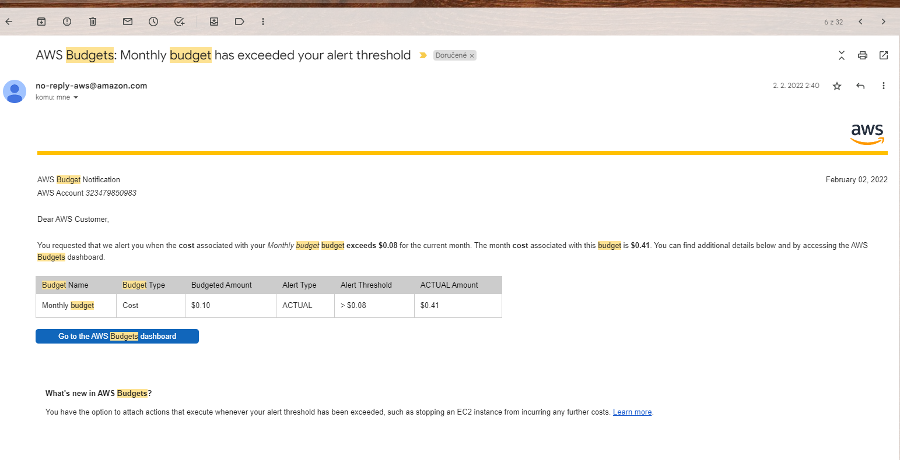

# Set up Budget

Budgets

- Find BUDGET service
- Click on "Create budget"

- 

- Two options - use template or custom , we will create custom budget setup, click on Customize
- Choose "Cost budget - Recommended" - we will monitor our costs in monthly or daily period

- 

- Fill budget name, choose period (time range of monitoring) - monthly , choose start date, 
- Enter your budgeted amount - 5$. We have budget 5$ for month.
- Choose scope options if you would like to filter specific AWS cost
- Click on next
- Add alert threshold, when alert should be triggered. E.g-80% in case of 5$ = when costs > 4$ then email will be sent

- 

- Review budget alert and create it

# Email notification

When threshold is reached then you will get email from AWS 

