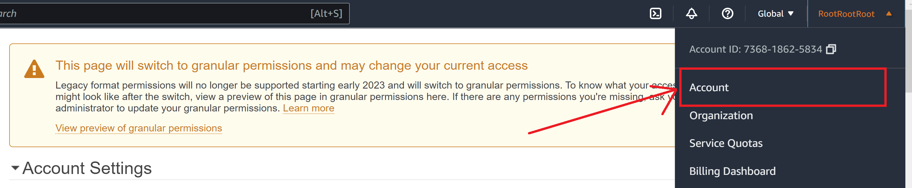
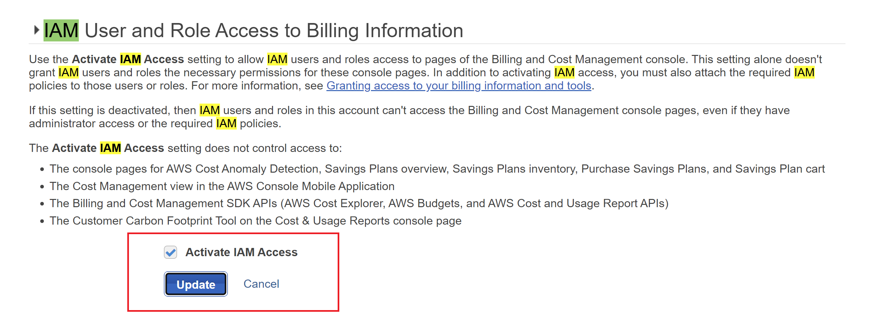

# Prerequisites

Optional - Enable aws budget for IAM users 
- log in as root
- Click on Account

- 

- Find section - "IAM User and Role Access to Billing Information"
- Clink on edit
- Enable - "Activate IAM Access"

- 
- In addition to activating IAM access, you must also attach the required IAM policies to those users or roles
- Attach policy : *AWSBudgetsActionsWithAWSResourceControlAccess*  to user/groups.
- Log out from root account
- Sign in as IAM user