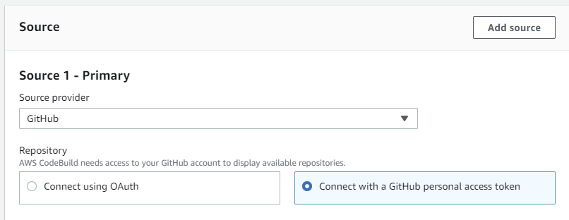
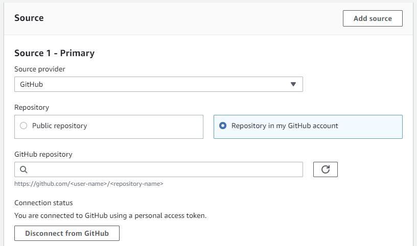
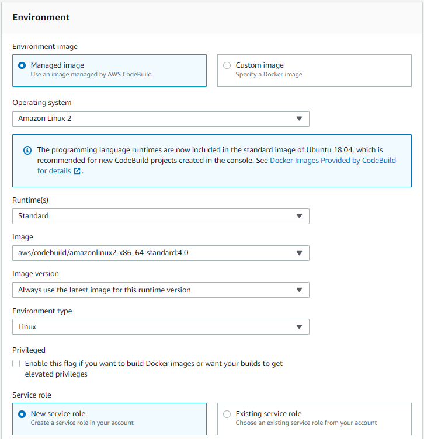
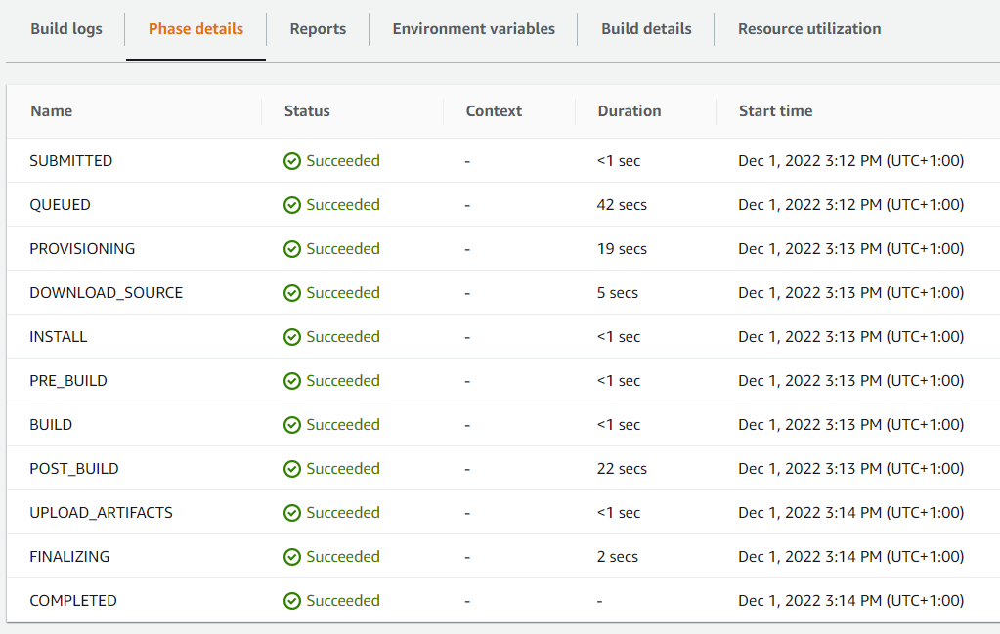

# Code Build

We will be creating two build projects (server/client)
and also two pipelines (client/server)

Build project for server part
-------------------------

1. Open the AWS CodeBuild console at [https://console.aws.amazon.com/codesuite/codebuild/home](https://console.aws.amazon.com/codesuite/codebuild/home).

2. If a CodeBuild information page is displayed, choose **Create build project**. 
Otherwise, on the navigation pane, expand Build, choose Build projects, and then choose Create build project.

3. Choose Create build project.

4. In **Project configuration**:
	
       **Project name**
	
     In Project name, enter a name for this build project. Build project names must be unique across each AWS account.

	
5. In **Source**:

	  **Source provider**
      Choose **GitHub**. In Repository choose **Connect with a GitHub personal access token**.
	  
	  

	  For **Personal Access Token**, paste the token you copied to your clipboard and choose Save Token.

	  **Repository URL**
	  In Repository URL, enter the URL for your GitHub repository.
	  
	  
	  
	  In **Source version** set branch for **refactor_dynamodb**.

6. In **Primary source webhook events**, select the following.

	Rebuild every time a code change is pushed to this repository.
	
	From Event type choose **PUSH**.

	

7. In **Environment**, select the following.

	- Environment image - Managed image
	- Operating system - Amazon Linux 2
	- Runtime - Standard
	- Image - aws/codebuild/amazonlinux2-x86_64-standard:4.0
	- Image version - Always use the latest image for this runtime version
	- Environment type - Linux
	- Service role - New service role (role name is generated automatically)
	
	

7. In **Buildspec**, select the following.

	- Choose **Use a buildspec file** to use the buildspec.yml file for server in the source code root directory.
	- Define name for buidspec file **buildspec_spring-boot-server.yml**.
	
	

8. Choose **Create build project**.
9. In Github settings in part **Webhooks** you should see new webhook.

	

10. Return to your CodeBuild project and start build.
11. In tab Phase details and Build logs you can see details for running build. 

	

Build project for client part
-------------------------

1. In Project name, enter a name for this build project. Build project names must be unique
2. Buildspec section
	- Choose Use a buildspec file to use the buildspec.yml file for client in the source code root directory.
	- Define name for buidspec file **buildspec_angular-11-client.yml**.
3. All other options are same as in build project for server part.