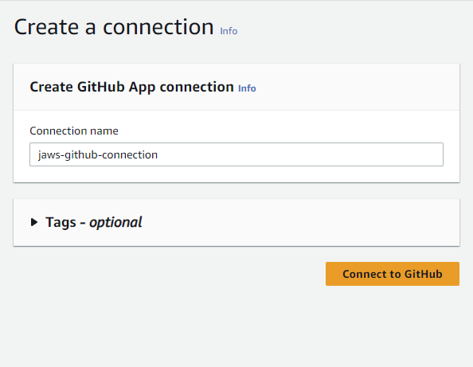

# CodePipeline

Code pipeline for client part
-------------------------

For deployment of client part we need S3 bucket. Go to section 
[S3](../../../postgreSQL/s3)

1. Open the CodePipeline console at [http://console.aws.amazon.com/codesuite/codepipeline/home](http://console.aws.amazon.com/codesuite/codepipeline/home).

2. On the Welcome page, Getting started page, or the Pipelines page, choose Create pipeline.

3. In Step 1: Choose **pipeline settings**, in Pipeline name, enter pipeline name.

4. In Service role, choose **New service role** to allow CodePipeline to create a new service role in IAM.

5. In Step 2: **Add source stage**, in Source provider, choose **GitHub (Version 2)**.

6. Under Connection, if you have not already created a connection to your provider, 
	choose Connect to GitHub. 
 
7. Create a connection.
	- In **Connection name**, enter the name for your connection.

	

	- Choose Connect to GitHub. 
	- Install a new app.
	
	
	
	- Choose your GitHub account
	
	- If prompted, on the GitHub login page, sign in with your GitHub credentials.
	- If you have multiple organizations, you might be prompted to choose the organization where you want to install the app.
	- Choose the repository settings where you want to install the app. Choose Install. 
	
	
	
	- After connection is succesfull you should see that GitHub is ready for use.

	

	
8. In Repository name, choose the name of your third-party repository. 

9. In Branch name, choose the branch where you want your pipeline to detect source changes.

10. Select Start the pipeline on source code change.

	
	!!! note
		The action accesses the files from the GitHub repository 
		and stores the artifacts in a ZIP file in the pipeline artifact store.

12. In Step 3: Add **Build provider**, choose **AWS CodeBuild**

13. In **Project name**, enter the name of the project for client you provided in build projects.

14. In Environment variables introduce new environment variable: **SPRING_PROFILES_ACTIVE** with value: **prod**
 
15. In Step 4: In **Add deploy stage**, for **Deploy provider**, choose **Amazon S3**.

16. For Bucket, choose the Bucket you created.

17. Select Extract file before deploy. 

18. After the pipeline has run successfully, you can see the result in a web browser. 

	
!!! note
	The deployment fails if you do not select Extract file before deploy. 
	This is because the AWS CodeCommit action in your pipeline zips source artifacts and your file is a ZIP file.

Code pipeline for server part
-------------------------

1. Procedure is the same as for client part, only with small changes in options for build and deploy stage.

2. In **Add Build provider**, choose AWS **CodeBuild**

3. In **Project name**, enter the name of the project for server you provided in build projects.

4. On **Add deploy stage**, for Deploy provider, choose AWS Elastic Beanstalk.

5. For Application name, choose the Elastic Beanstalk application you just created.

6. For Environment name, choose the environment you just created.

