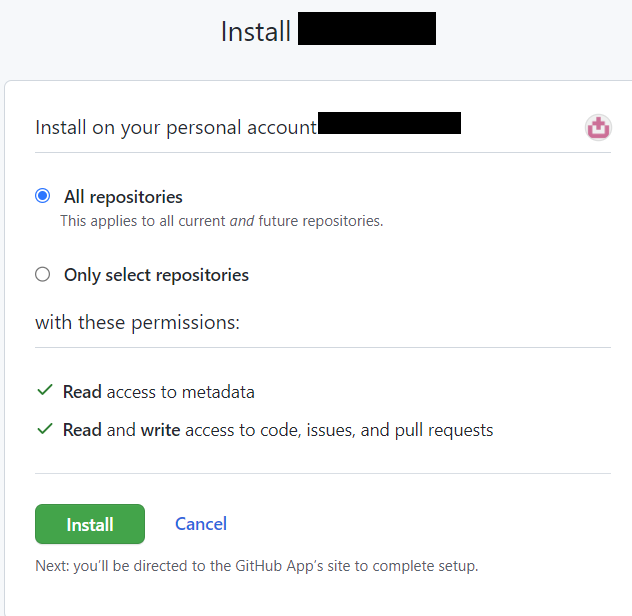
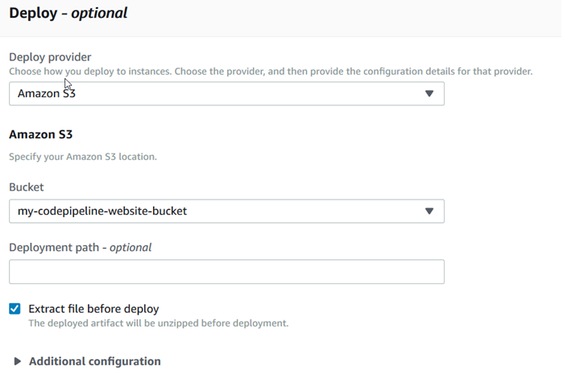

# CodePipeline

Code pipeline for client part
-------------------------

For deployment of client part we need S3 bucket. Go to section 
[S3](../../../postgreSQL/s3)

1. Open the CodePipeline console at [http://console.aws.amazon.com/codesuite/codepipeline/home](http://console.aws.amazon.com/codesuite/codepipeline/home).

2. On the Welcome page, Getting started page, or the Pipelines page, choose Create pipeline.

3. In Step 1: Choose **pipeline settings**, in Pipeline name, enter pipeline name.

4. In Service role, choose **New service role** to allow CodePipeline to create a new service role in IAM.

5. In Step 2: **Add source stage**, in Source provider, choose **GitHub Enterprise Server**.

6. Under Connection, if you have not already created a connection to your provider, 
	choose Connect to GitHub Enterprise Server. 
 
7. Connect to GitHub Enterprise Server.
	- In **Connection name**, enter the name for your connection.
	- In **URL**, enter the endpoint for your server. 

	

	- Choose Connect to GitHub Enterprise Server. The created connection is shown with a Pending status. 
	- A host resource is created for the connection with the server information you provided. For the host name, the URL is used.
	- Choose Update pending connection. 

	

	- If prompted, on the GitHub Enterprise login page, sign in with your GitHub Enterprise credentials.
	- On the Create GitHub App page, choose a name for your app.
	- On the GitHub authorization page, choose Authorize <app-name>.
	- On the app installation page, a message shows that the AWS CodeStar Connector app is ready to be installed. 
	- If you have multiple organizations, you might be prompted to choose the organization where you want to install the app.
	- Choose the repository settings where you want to install the app. Choose Install. 
	- The connection page shows the created connection in an Available status.

	

	
8. In Repository name, choose the name of your third-party repository. 

9. In Branch name, choose the branch where you want your pipeline to detect source changes.

10. Select Start the pipeline on source code change.

11. To store output artifacts from the GitHub Enterprise Server action using the default method, 
	choose CodePipeline default. 
	
	!!! note
		The action accesses the files from the GitHub Enterprise Server repository 
		and stores the artifacts in a ZIP file in the pipeline artifact store.
	
	
12. Add **Build provider**, choose **AWS CodeBuild**

13. In **Project name**, enter the name of the project for client you provided in build projects.
 
14. In **Add deploy stage**, for **Deploy provider**, choose **Amazon S3**.

15. For Bucket, choose the Bucket you created.

16. Select Extract file before deploy. 

17. After the pipeline has run successfully, you can see the result in a web browser. 

	
!!! note
	The deployment fails if you do not select Extract file before deploy. 
	This is because the AWS CodeCommit action in your pipeline zips source artifacts and your file is a ZIP file.

Code pipeline for server part
-------------------------

1. Procedure is the same as for client part, only with small changes in options for build and deploy stage.

2. In **Add Build provider**, choose AWS **CodeBuild**

3. In **Project name**, enter the name of the project for server you provided in build projects.

4. On **Add deploy stage**, for Deploy provider, choose AWS Elastic Beanstalk.

5. For Application name, choose the Elastic Beanstalk application you just created.

6. For Environment name, choose the environment you just created.

