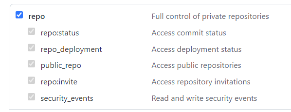

# Prerequisites

Generate a personal access token for your CodeBuild project. 
We recommend that you create a GitHub Enterprise user and generate a personal access token for this user. 
Copy it to your clipboard so that it can be used when you create your CodeBuild project. 

- In GitHub open settings -> Developer settings -> Personal Access tokens
- Click on Generate new token 

- When you create the personal access token, include the repo scope in the definition. 

- Save generated personal access token 