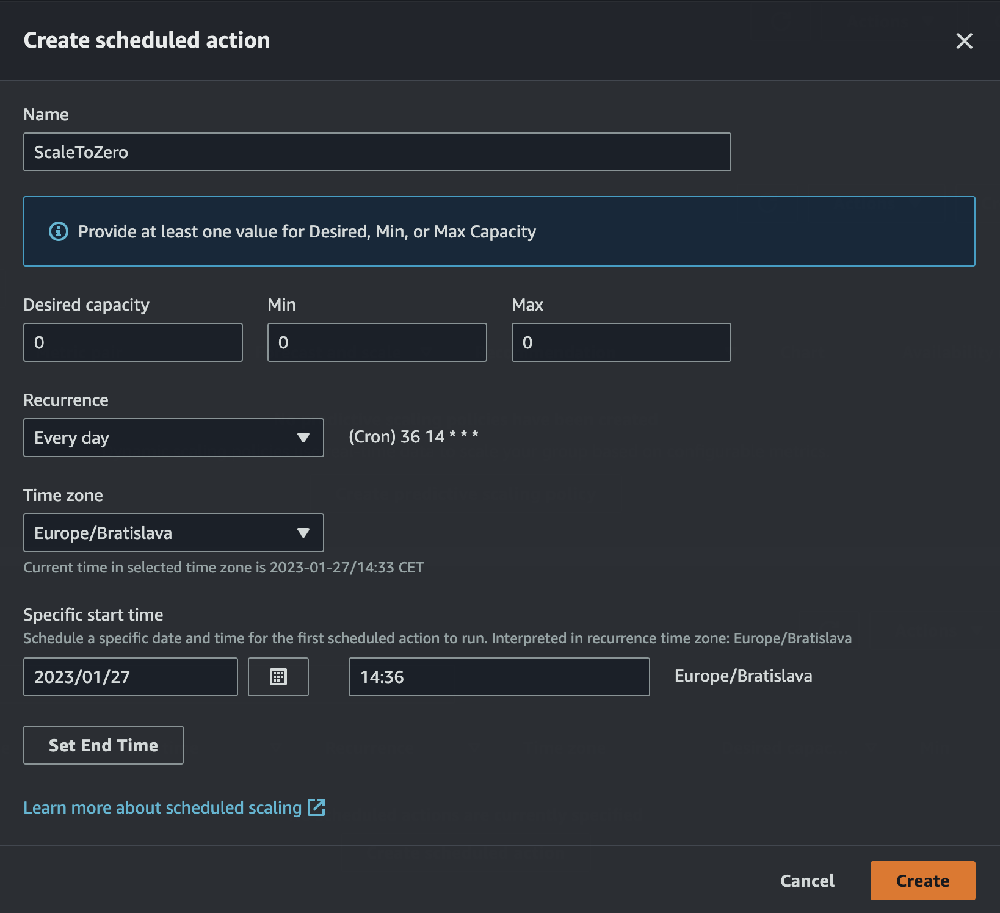
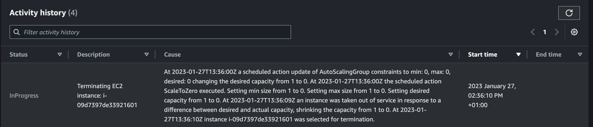
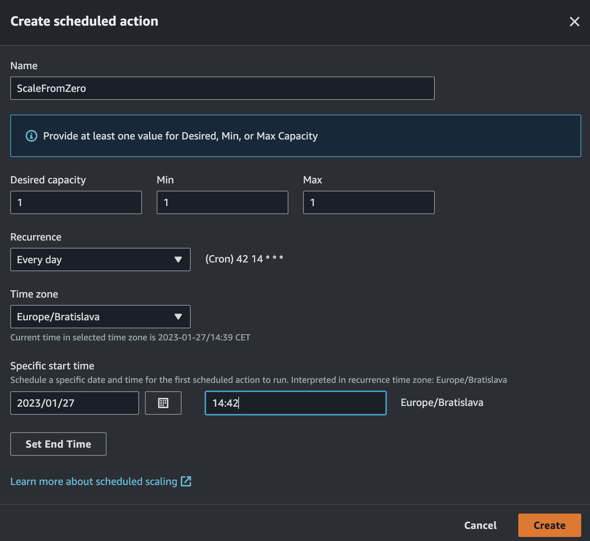

# Scheduled Scaling

One of the major advantages of the public cloud usage is the option to scale the infrastructure, based on the current demand.
To save the costs, we'll have a look at the horizontal scaling scenario, the scale-down option.

## Scheduled Scaling of the EC2 instances

1. Navigate to: EC2 -> Auto Scaling groups (ASGs)
1. Click the name of specific ASG
1. Pick Automatic Scaling tab
1. Scroll down and in the Scheduled Actions section click Button: Create scheduled action
1. Name the rule and pick the timeframe close to current one (e.g. in 2 min), to see scaling happen. Setting the Capacity: Desired = Min = Max = 0.

1. Wait for the rule to be applied (check the Activity -> Activity History):

1. Create another rule, mame the rule and pick the timeframe close to current one (e.g. in 2 min). Setting the Capacity back to: Desired = Min = Max = 1

1. Wait for the rule to be applied (check the Activity -> Activity History):

