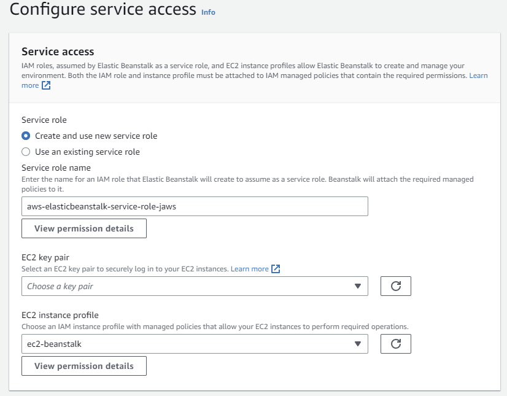
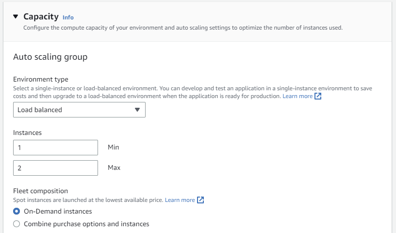

# Elastic Beanstalk

High-level view
-------------------------

Create Environment
-------------------------
1. Open Elastic Beanstalk console at [https://console.aws.amazon.com/elasticbeanstalk/](https://console.aws.amazon.com/elasticbeanstalk/).
2. On the application overview page, choose Create a new environment.
3. For environment tier, choose the **Web server environment**.
4. Enter an application name.
5. Choose platform **Java**. 
6. Application code – choose “Upload your code”.
7. Upload builded application (jar file). 

8. In section Presets choose **High availability** and choose **Next**.
9. The Configure service access page displays.
10. Choose **Create and use new service role** for Service Role.
11. Enter **Service role name**.
12. If the **EC2 instance profile** dropdown list doesn't list any values to choose from, 
	Choose **View permission details**. This displays under the **EC2 instance profile** dropdown list
13. A modal window titled View instance profile permissions displays. This window lists the managed profiles that you'll need to 
	attach to the new EC2 instance profile that you create. It also provides a link to launch the IAM console.
14. Choose the **IAM console** link displayed at the top of the window.
15. In the IAM console navigation pane, choose **Roles**.
16. Choose **Create role**.
17. Under **Trusted entity type**, choose **AWS service**.
18. Under **Use case**, choose **EC2**.
19. Choose **Next**.
20. Attach the appropriate managed policies. Scroll in the **View instance profile permissions** modal window to see the managed policies. 
	The policies are also listed here:
	
		AWSElasticBeanstalkWebTier

		AmazonDynamoDBFullAccess

		AmazonRDSDataFullAccess
		
		SecretsManagerReadWrite
		
21. Choose **Next** and Enter a name for the role.
22. Choose **Create role**.
23. Return to the Elastic Beanstalk console window that is open.
24. Close the modal window **View instance profile permissions**.
25. Choose refresh icon, next to the **EC2 instance profile** dropdown list.
	This refreshes the dropdown list, so that the Role you just created will display in the dropdown list.
	
	

26. The default settings remain in  **Set up networking, database, and tags** step.
27. Step **Configure instance traffic and scaling**.
28. In Section **Capacity** set Environment type to **Load balanced**.
29. Set Maximum for instances to 2.

	

30. Set Instance types: **t2.micro**.
31. Set Availability Zones: **Any 1**.
32. Set Placement: **eu-central-1**.

	
	
33. In section **Load Balancer Type** choose load balancer type **Application Load Balancer**.
34. In part Processes change this values:
	- Port      : **8080**
	- HTTP code : **200-299**
	- Health check path : **/api/tutorials**
	

35. Choose **Next**.
36. Step **Configure updates, monitoring, and logging**.
37. In Section **Health reporting** set System to **Basic**.

		

38. In Section **Rolling updates and deployments** set Deployment policy to **All at once**.
39. Set **Ignore health check** to **True**
40. Enable streaming of the logs to Cloudwatch, by setting the checkbox 
	(We will need this for later analysis in in part [Logs analysis using CloudWatch](../part6/#build-client)):
	
	
	
41. In section **Environment properties** introduce new environment variable: **SPRING_PROFILES_ACTIVE** with value: **prod**.
				

42. Check Review page and submit.
43. If you're using AWS Academy account

!!! warning
	Scroll down to the Security panel and choose Edit:
	- Service role, choose: **LabRole**
	- For EC2 key pair, choose: **vockey**
	- For IAM instance profile choose: **LabInstanceProfile**
	Supported Instance types: nano, micro, small, medium, and large. If you attempt to launch a larger instance type, it will be terminated.

!!! note
	This will take a few minutes. Beanstalk will create EC2 instance, Elastic load balancer, 
	Auto Scaling Group, Target group, Security Group, CloudWatch Alarm.	