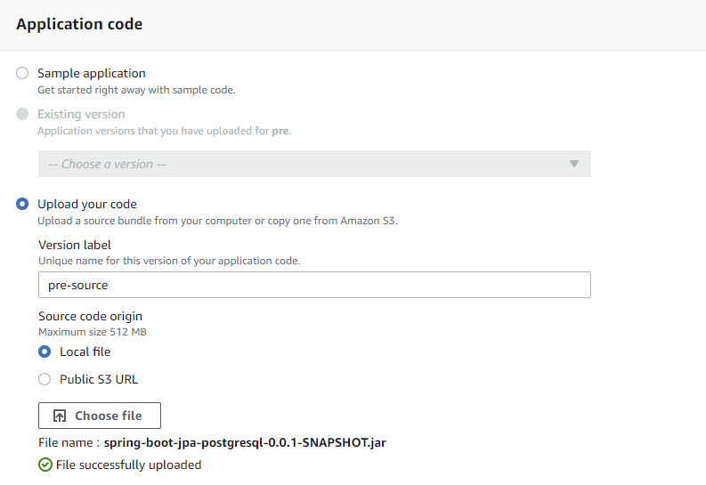
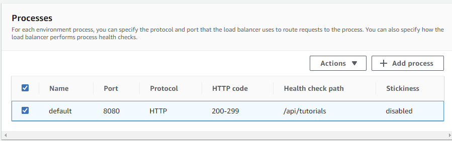
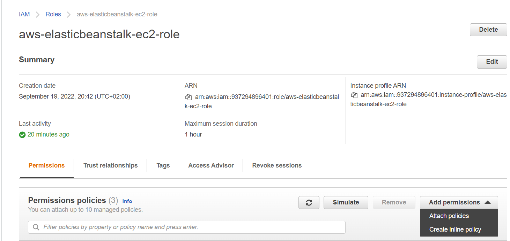

# Elastic Beanstalk

High-level view
-------------------------

Create Environment
-------------------------
1. Open Elastic Beanstalk console at [https://console.aws.amazon.com/elasticbeanstalk/](https://console.aws.amazon.com/elasticbeanstalk/).
2. On the application overview page, choose Create a new environment.
3. For environment tier, choose the **Web server environment**.
4. Enter an application name.
5. Choose platform **Java**. 
6. Application code – choose “Upload your code”.
7. Upload builded application (jar file). **An alternative is to use the already builded jar file that is in the slack channel jaws-help.** 

8. Go to Configure more options.
9. In section Presets choose **High availability**.
10. In section Software introduce new environment variable: **SPRING_PROFILES_ACTIVE** with value: **prod**.
				
Moreover, Enable streaming of the logs to Cloudwatch, by setting the checkbox (We will need this for later analysis in in part [Logs analysis using CloudWatch](../part6/#build-client)):
		
11. In section Capacity set Max instances to **1**.

12. In section load balancer choose load balancer type **Application Load Balancer**.
13. In part Processes change this values:
	- Port      : **8080**
	- HTTP code : **200-299**
	- Health check path : **/api/tutorials**
			
14. Create Environment
!!! note
	This will take a few minutes. Beanstalk will create EC2 instance, Elastic load balancer, 
	Auto Scaling Group, Target group, Security Group, CloudWatch Alarm.	

Permissions policies for EC2
-------------------------
1. Go to EC2 service.

2. Select instance created by Beanstalk.

3. Go to security tab and click on IAM Role of EC2 instance.

4. Identity and Access Management (IAM).

5. Select Add permissions -> Attach policies.

6. In section "Other permissions policies" search for **AmazonDynamoDBFullAccess**
    Select **AmazonDynamoDBFullAccess** policy and attach policy
