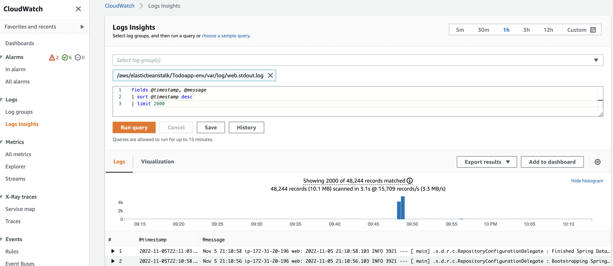

# Logs analysis using CloudWatch

High-level view
-------------------------

Display the application logfiles using CloudWatch
-------------------------
- Go to Amazon CloudWatch service
- Open Logs insight and for the log groups pick: /aws/beanstalk/.../var/log/web.stdout.log and in the query change limit to 2000.
- Hit Run Query button afterwards (please note there is an option in the upper right corner to change the time range of the displayed logs)

