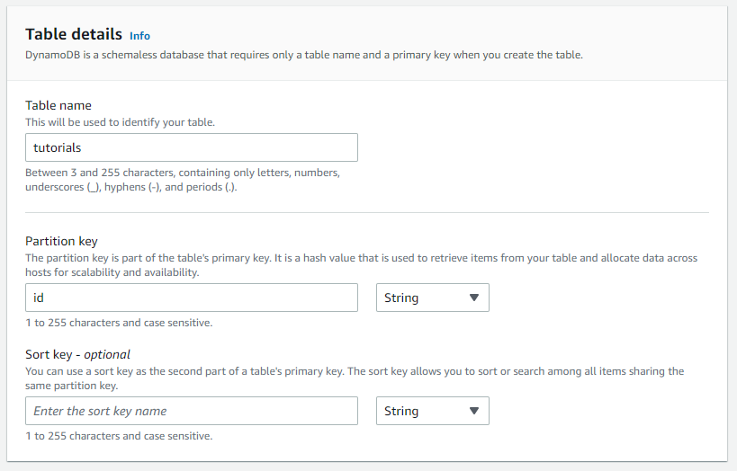

# DynamoDB

High-level view
-------------------------

Create DynamoDB table
-------------------------

1. Open the Amazon DynamoDB console at [https://console.aws.amazon.com/dynamodb](https://console.aws.amazon.com/dynamodb/).

2. Create table.

3. Enter table name: **tutorials**.

4. Enter partition key: **id**.

