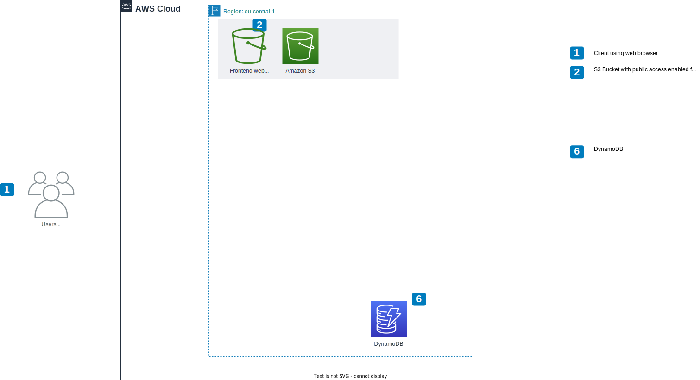
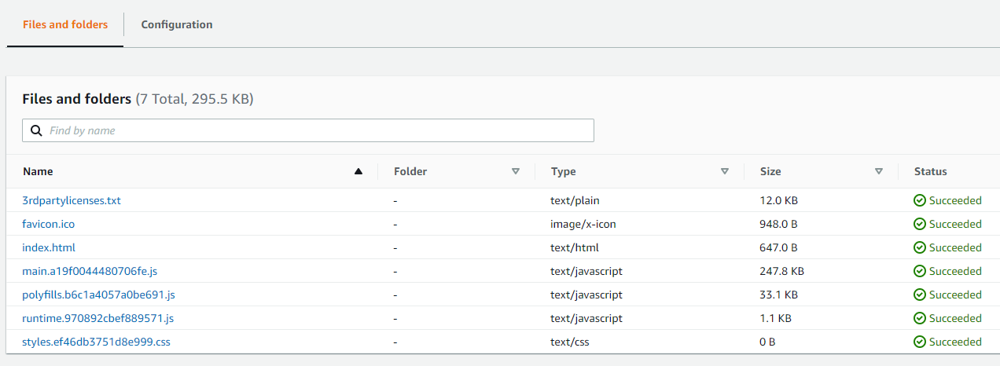
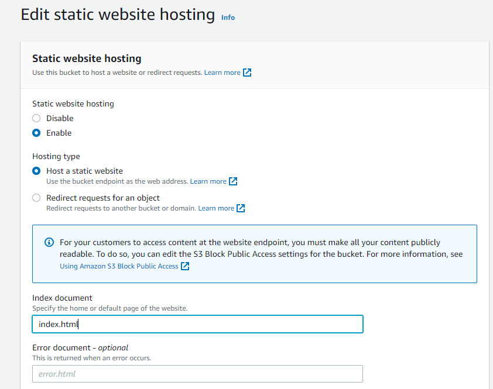
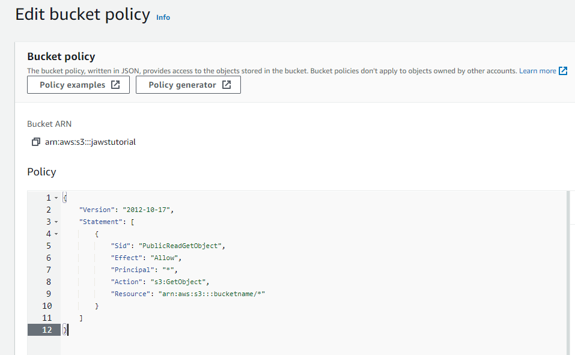
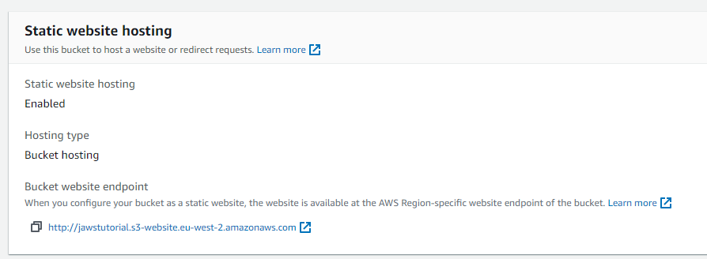

# S3

High-level view
-------------------------

Create bucket
-------------------------

1. Open the Amazon S3 console at [https://console.aws.amazon.com/s3/](https://console.aws.amazon.com/s3/).
2. Create bucket.
3. Choose unique bucket name.
4. AWS Region = `eu-central-1`.
5. Grant public access to bucket and objects.	

6. Create bucket.

Build and upload project
-------------------------

1. Build application with command *ng build --configuration production* and the resulting built 
is placed under */dist/&#60;app name&#62;*. **An alternative is to use the already created client files 
that are in the slack channel jaws-help**.

2. Select S3 bucket and upload those static files into the bucket.

		
Static website hosting
-------------------------

1. Open bucket in buckets view and go to properties.

2. Go to section static website hosting -> edit.

3. Enable static website hosting.

4. Specify index document: **index.html**			

5. Save changes.

!!! note
	When you configure a bucket as a static website, if you want your website to be public, you can grant public read access. 
	To make your bucket publicly readable, you must disable block public access settings for the bucket and 
	write a bucket policy that grants public read access.

Edit bucket policy (optional)
-------------------------

1. Open bucket in buckets view and go to permissions.
2. Edit bucket policy.
3. Copy this bucket policy (replace **&#60;bucketname&#62;** with real bucket name).

		{
			"Version": "2012-10-17",
			"Statement": [
				{
					"Sid": "PublicReadGetObject",
					"Effect": "Allow",
					"Principal": "*",
					"Action": "s3:GetObject",
					"Resource": "arn:aws:s3:::<bucketname>/*"
				}
			]
		}
		

4. Save Changes.  
5. Go to section static website hosting and open bucket website endpoint in browser.

 
