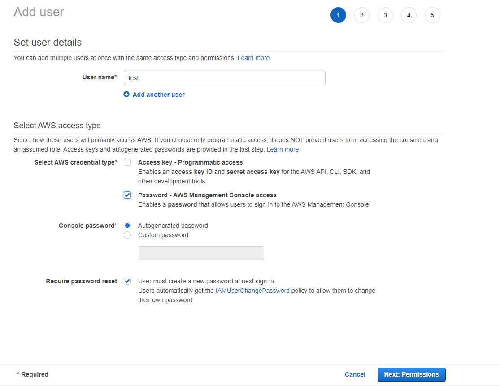
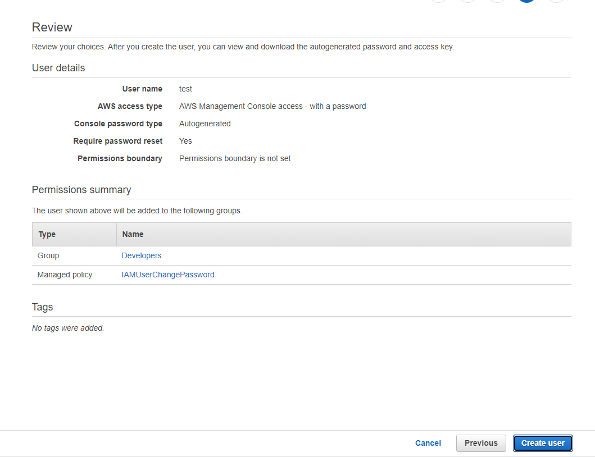

# Creating user

Root account is not recommend to perform everyday tasks.

- Search Identity and Access Management (IAM) service 

- Click on Add User

- Fill properties, Credentials - pwd or access key ID

- 

- Click on Next, then we have to assign user to existing group (create or attach already existing in was), we will create own group

- Fill group name (e.g. Developers) and attach permission to group - e.g. - AmazonEC2FullAccess, AmazonS3FullAccess, IAMFullAccess, AWSLambda_FullAccess, AmazonSQSFullAccess

- In next page there we can set tags to our new user. It is optional, sorting in logs can be easier via tags.

- Review user and create.

- 

- We have created user and now it's time to send credentials to person, who will be use user account

- Email login instructions - fill person email and person will receive email instruction how to log in

- Password - root user have default password for account, It is valid only once - during first login. User will change it first successful login
