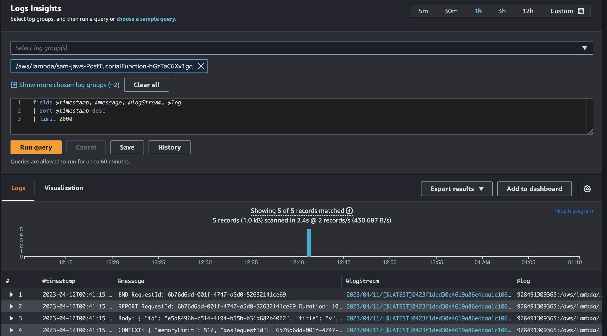

# Logs analysis using CloudWatch

Display the application logfiles using CloudWatch
-------------------------
- Go to Amazon CloudWatch service
- Open Logs insight and for the log groups pick: /aws/lambda/sam-jaws/... group, potentially you can expand limit to 10000 if you need to.
- Hit Run Query button afterwards (please note there is an option in the upper right corner to change the time range of the displayed logs)

