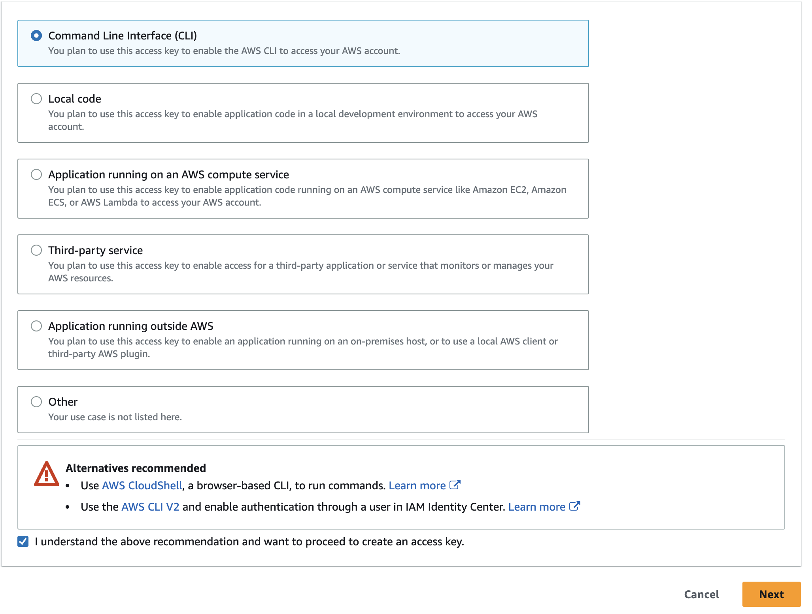

# IAM Access Key Setup

To setup the access key, 2 steps are needed:

* in the AWS Console generate the access key
* setup the access key for local usage

## Generating access keys for user
To generate access keys for the user created in: , navigate in AWS console to:

- Identity and Access Management (IAM) service 
- Click Access Management -> Users
  
- Pick the user of your choice
- Navigate to Security credentials tab
- Click Create Access Key button
  
- Click: `Command Line Interface (CLI)` and mark checkbox: `I understand the above recommendation and want to proceed to create an access key.`
  
- Click Next
- Create tag of your choice, e.g.: JAWS and click Next
  
- Copy/note the key and value:
  
- Click done button
- Once done, it should be listed in the user's access keys section:
  


## Local Setup

- open `~/.aws/credentials` file
- add previously copied Access key and Secret access keys to new AWS profile called: `jaws` (please note region as well as output format would be set):
        ```
        [jaws]
        aws_access_key_id=<Access key>
        aws_secret_access_key=<Secret access key>
        region=eu-central-1
        output=json
        ```
- check keys are working OK, by executing sample aws command (for listing S3 buckets):
        ```
        aws s3 ls --profile jaws
        ```