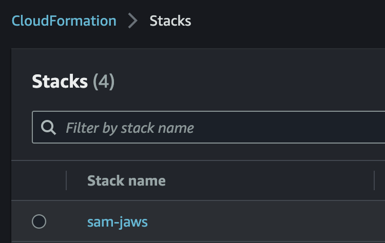
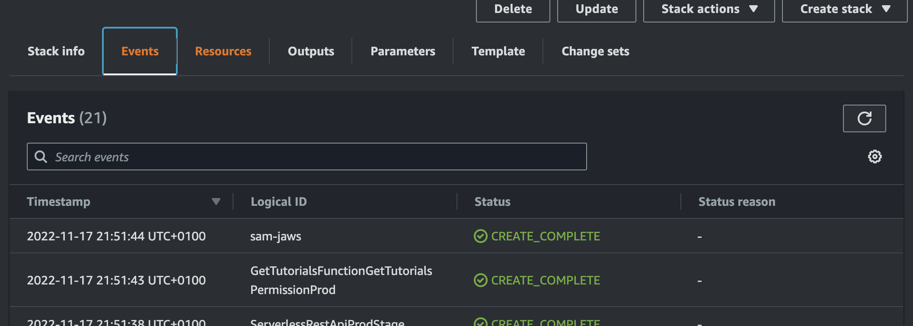
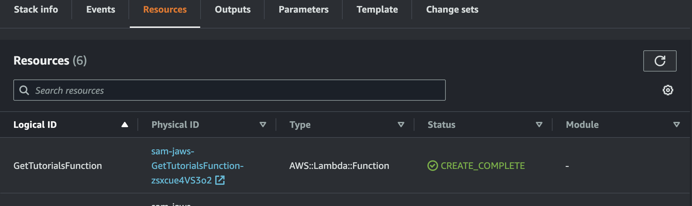

# AWS Serverless Application Model (SAM)

AWS SAM ( https://aws.amazon.com/serverless/sam/ ):
> The AWS Serverless Application Model (SAM) is an open-source framework for building serverless applications. It provides shorthand syntax to express functions, APIs, databases, and event source mappings. With just a few lines per resource, you can define the application you want and model it using YAML. During deployment, SAM transforms and expands the SAM syntax into AWS CloudFormation syntax, enabling you to build serverless applications faster.

Retrieve project sources
--------

Clone project from github.ibm.com and switch to refactor_lambda branch

    git clone git@github.ibm.com:jAWS/ToDo-app.git
    cd ToDo-app
    git switch refactor_lambda
    git status

Result:

      On branch refactor_lambda
      Your branch is up to date with 'origin/refactor_lambda'.

Build and deploy (using SAM)
--------
1. To build run: 

        cd lambda
        sam build

2. To deply run:

        sam deploy --profile jaws --resolve-s3 --stack-name sam-jaws --capabilities CAPABILITY_IAM --no-fail-on-empty-changeset --region eu-central-1

3. Provisioning itself is handled by the CloudFormation. To see the progress, check the Cloudformation service -> stack: `sam-jaws`, the tab: Events.
   
   

4. To see the provisioned resources, navigate to tab resources:
   


Build client
-------------------------

1. Navigate to `angilar-11-client` folder
1. Build application with command **ng build --configuration production**	
1. Build result will be in folder **dist**	

Upload client
-------------------------

1. Go to S3 bucket created by SAM (see the bucket name in the console output of the `sam deploy` command)
1. Upload files 
1. Upload -> add files 
1. Navigate to dist folder -> Angular11Crus -> select all files
1. Upload files


Check API exposed
----
In the browser navigate to URL shown in the console output of the `sam deploy` command e.g.:
```
CloudFormation outputs from deployed stack
---------------------------------------------------------------------------------------------------------------------------------------------------------------------------------------------------------------------------------------------
Outputs
---------------------------------------------------------------------------------------------------------------------------------------------------------------------------------------------------------------------------------------------
Key                 TutorialsApi
Description         API Gateway endpoint URL for Get Tutorials function
Value               https://1i3jgli6sg.execute-api.eu-central-1.amazonaws.com/Prod/api/tutorials

Key                 CloudFrontUrl
Description         CloudFront URL
Value               https://d37c32w4ljwkhq.cloudfront.net

Key                 DynamoDbTable
Description         DynamoDB Table where tasks are stored
Value               sam-jaws-TutorialsTable-1B0RGCIQUGB38

Key                 ClientS3Bucket
Description         S3 bucket for client site publishing
Value               sam-jaws-s3bucket-fxrwbod4iz86
---------------------------------------------------------------------------------------------------------------------------------------------------------------------------------------------------------------------------------------------

Successfully created/updated stack - sam-jaws in eu-central-1
```

So in my case: https://d37c32w4ljwkhq.cloudfront.net
