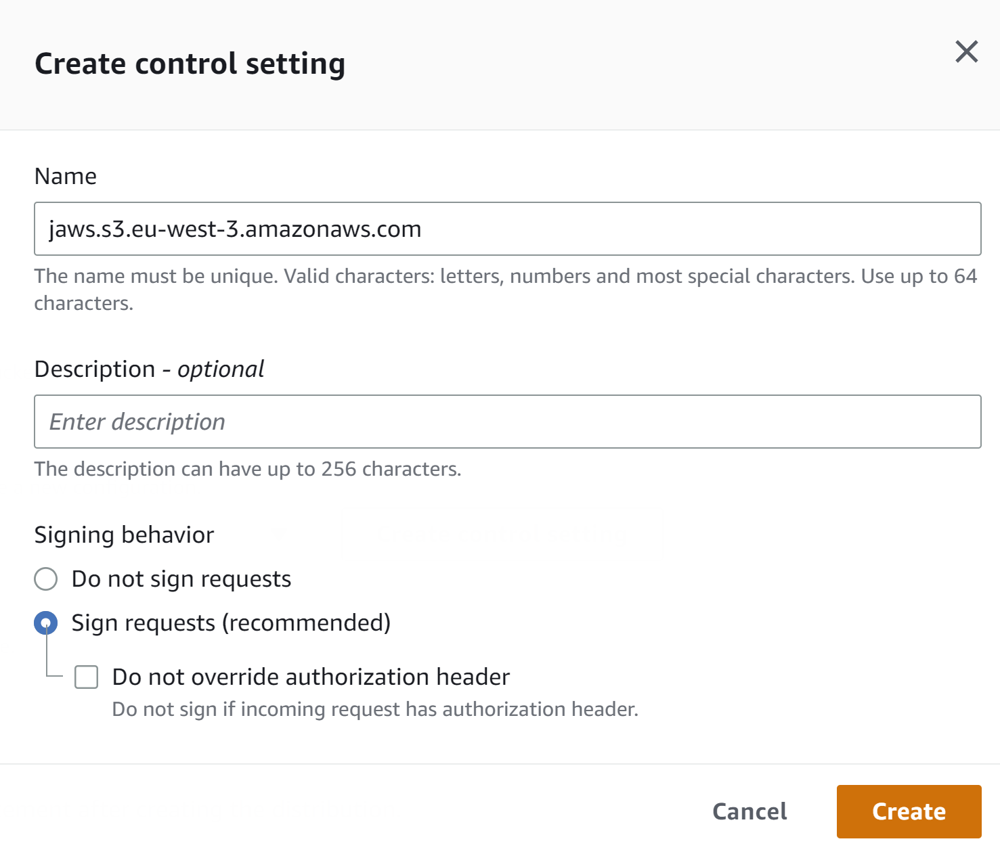

# CloudFront

Create CloudFront 
-------------------------

1. Open the Amazon S3 console at [https://console.aws.amazon.com/cloudfront/](https://console.aws.amazon.com/cloudfront/).
2. Create distribution.
3. Set origin domain for client - find S3 Bucket.
4. Origin access set to **Origin access control settings**.
5. For Origin access control Create new control setting.	

CloudFront will provide us policy statement for bucket policy after creating the distribution.
6. For Allowed HTTP methods choose **GET, HEAD, OPTIONS, PUT, POST, PATCH, DELETE**.	
7. In section Cache key and origin requests use recommended cache policy and disable caching and set
	Origin request policy to **CORS-S3Origin**.		
		
8. Default root object set to **index.html**.
9. Create distribution.
10. After distribution is created pop up window offer us new bucket policy. Copy it and replace existing policy in our S3 bucket.
	
11. In Origins section create origin.
12. Set origin domain for application load balancer - find ELB.
13. Create origin.
14. In Behaviours section create behaviour.
15. Set Path pattern to **/api/***
16. Set Origin and origin groups to ELB.
17. For Allowed HTTP methods choose **GET, HEAD, OPTIONS, PUT, POST, PATCH, DELETE**.
18. In section **Cache key and origin requests** use recommended cache policy and disable caching and set 
	Origin request policy to AllViewer.

19. After behaviour is created distribution is redeployed. After succesfull deployment open website with distribution domain name.
 (General section)
 
