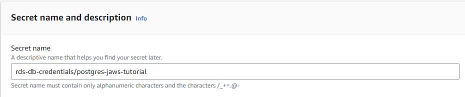
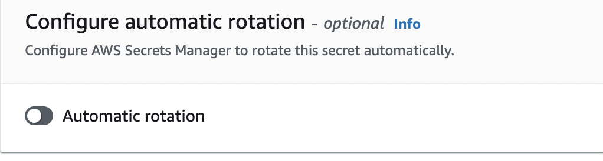

# Secrets Manager

Storage of the Postgres password in AWS Secrets Manager
----

1. Open the Amazon Secrets Manager service console at [https://console.aws.amazon.com/secretsmanager/](https://console.aws.amazon.com/secretsmanager/).
2. Click "Store a new secret" button.
3. Choose Secret type of: "Credentials for Amazon RDS database".
4. Provide previously created DB Username and Password.
5. Select the Database, that was created previously from the list.
6. Click Next.

7. Enter Secret name: **rds-db-credentials/postgres-jaws-tutorial** (please note to keep the prefix: rds-db-credentials/* , as the Policy we'll attach to EC2 instance in the [later step: Elastic Beanstalk](../part4/#permissions-policies-for-ec2) called: **AmazonRDSDataFullAccess** expects the naming convention)

8. Click Next.
9. Disable Automatic rotation.

10. Click Next and Store secret.

