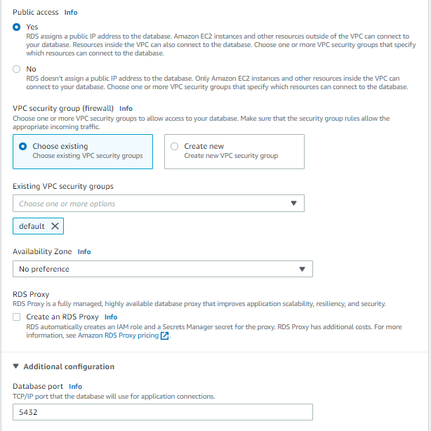
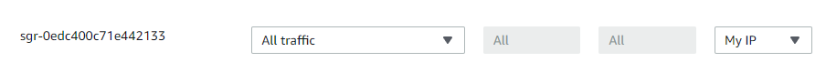

# RDS PostgreSQL

Creating a PostgreSQL DB instance
-------------------------

1. Sign in to the AWS Management Console and open the Amazon RDS console at [https://console.aws.amazon.com/rds/](https://console.aws.amazon.com/rds/).
2. In the upper-right corner of the Amazon RDS console, choose the AWS Region in which you want to create the DB instance.
3. In the navigation pane, choose Databases.
4. Choose Create database and make sure that Standard create is chosen.
5. In Engine options, choose PostgreSQL.
6. For Templates, choose Free tier.

7. For DB instance identifier, enter a name for the DB instance, or leave the default name.
8. For Master username, enter a name for the master user, or leave the default name (postgres).
9. Enter the same password in Master password and Confirm master password.
10. In part Connectivity, set public access to Yes.

11. Create database.
!!! note

	On the RDS console, the details for new DB instance appear. 
	The DB instance has a status of Creating until the DB instance is ready to use. 
	When the state changes to Available, you can connect to the DB instance. 
	Depending on the DB instance class and the amount of storage, it can take up to 20 minutes before the new instance is available.

Provide access to your DB instance in your VPC (optional)
-------------------------

!!! note

	VPC security groups provide access to DB instances in a VPC. They act as a firewall for the associated DB instance, 
	controlling both inbound and outbound traffic at the DB instance level. 
	DB instances are created by default with a firewall and a default security group that protect the DB instance.
	
!!! note

	Before you can connect to your DB instance, you must add rules to a security group that enable you to connect. 
	Use your network and configuration information to create rules to allow access to your DB instance.
	
1. In the navigation pane of your database, choose Connectivity & security.
2. Open security group which is associated with database instance.

3. In Inbound rules, choose Edit inbound rules.
4. Add rule:

		Type: All traffic
	
		Source: My IP
	

	
Connecting to a PostgreSQL DB instance (optional)
-------------------------

1. Launch the DBeaver application on your client computer.
2. Choose Database -> New Database Conection from the menu.
3. Choose PostgreSQL database driver.
4. Enter the DB instance endpoint (for example, database-1.123456789012.us-west-1.rds.amazonaws.com) in the Host box.
5. Enter the port you assigned to the DB instance for Port. 
6. Enter the user name and user password that you entered when you created the DB instance for Username and Password.
7. Choose OK.

!!! note

	In some cases, you might have difficulty connecting to the DB instance. If so, the problem is most often with the access rules that you set up. 
	These reside in the security group that you assigned to the DB instance.
	
!!! note

	If your DB instance is publicly accessible, make sure its associated security group has inbound rules for the IP addresses 
	that you want to access it. If your DB instance is private, 
	make sure its associated security group has inbound rules for the security group of each resource to access it.