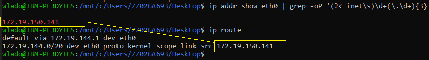

# Local Environment support

Helpful page for fixing issues during set up local environment.

## Checking ip route for WSL ( setting DB address for backend  )
In WSL run command 
```http
 ip addr show eth0 | grep -oP '(?<=inet\s)\d+(\.\d+){3}'
```

or 
```http
 ip route 
```


and then set address to application properties of your backend (spring-boot-server)

```http
spring.datasource.url= jdbc:postgresql://172.19.150.141:5432/jawstutorial
```

## Missing values in registries
Error message:
```http
Error: short-name "postgres:14-alpine" did not resolve to an alias and no unqualified-search registries are defined in "/etc/containers/registries.conf"
```
Fix:

- In WSL run: ``` sudo vi /etc/containers/registries.conf ```
- Add to registries.conf this line :  ``` registries = ['docker.io', 'quay.io'] ```


## ERRO[0000] error joining network namespace for container

Error message:
```bash
podman ps
ERRO[0000] error joining network namespace for container 60cb48303fd3dfd191b6924aae4b2c7865d5bb4ef39f573fbe0086b9c78f5ad8: error retrieving network namespace at /tmp/podman-run-1000/netns/cni-fcd7c7fb-b057-8bb4-59a1-d492664aeda4
```
Fix:
```bash
podman rm 60cb48303fd3dfd191b6924aae4b2c7865d5bb4ef39f573fbe0086b9c78f5ad8  -f 
```

##  Issue while starting podman-compose on MacOS 

You need to init+start the podman machine first, via:
```bash
podman machine init --cpus=2 --disk-size=60 --memory=8096 -v $HOME:$HOME
```
and then
```bash
podman machine start
```

##  Permission denied (publickey).
Your ssh public key is not in your Github account https://github.ibm.com/settings/keys

Follow official documentation: https://docs.github.com/enterprise-server@3.3/articles/generating-an-ssh-key/

##  Docker-compose in Ubuntu for windows

In docker App you need set properties like that


##  Skip podman/docker compose and install postgreSQL directly to WSL

```bash
sudo apt install postgresql
sudo service postgresql start
sudo -u postgres psql
\password postgres
CREATE DATABASE jawstutorial;
exit
```

##  Installing WSL2 + Ubuntu to eliminate "cannot re-exec process" error :
```
1.	Turn windows features on and off – select Virtual Machine Platform
2.	Install wsl - 		PowerShell: 	wsl --install
3.	Set default wsl2 - 	PowerShell: 	wsl --set-default-version 2
4.	Install ubuntu - 	PowerShell: 	wsl --install -d ubuntu
5.	Upgrade ubuntu - 	Ubuntu: 	sudo apt update; sudo apt upgrade
6.	Install podman - 	Ubuntu: 	sudo apt install podman
7.	Create postgres pod -	Ubuntu:	cd ToDo-app/docker-compose; podman play kube postgres.yaml
```